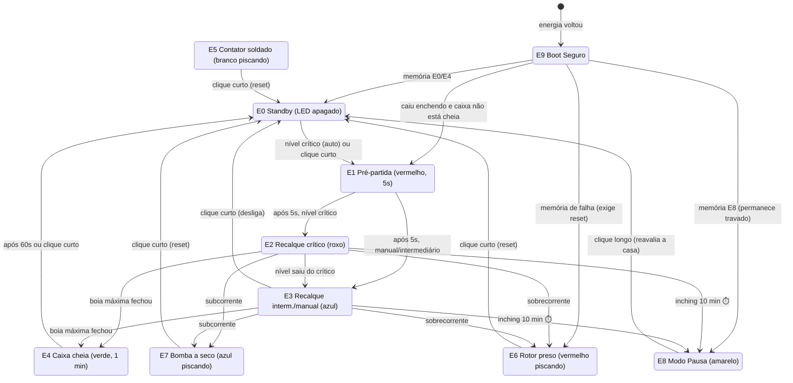

# 💧 Caixa D'Água Inteligente

**Controlador de bombeamento cisterna → caixa d'água com ESP32-C3 + ESPHome, projetado como um "tanque de guerra": imune a apagões, erros humanos e falhas de sensor.**


Um único botão de inox na cozinha, com LED RGB, comanda e reporta tudo. A lógica de segurança roda **100% local no ESP32** — Wi-Fi e Home Assistant são só telemetria e conveniência: se a rede cair, o sistema nem percebe.

---

## Destaques

- **Máquina de estados completa** (10 estados) com persistência em flash e recuperação segura pós-apagão
- **Um botão, duas intenções:** clique curto (< 1 s) liga/desliga/reseta; clique longo (≥ 1.5 s) ativa o Modo Pausa soberano
- **LED RGB como interface:** cada estado tem uma cor — de apagado (tudo OK) a branco piscando (alarme máximo)
- **Inching:** a bomba nunca fica ligada mais de 10 min contínuos — proteção contra boia quebrada
- **Detecção de corrente fantasma:** relé desligado + corrente no motor = contator soldado → alarme para desligar o disjuntor
- **Sensor de nível supervisionado (laço EOL):** cabo rompido, em curto ou desconectado é detectado, como em central de alarme
- **Histerese anti-marola:** ondulação da água não causa oscilação de estado nem desgaste da flash
- **Botão digital no Home Assistant:** réplica fiel do botão físico — mesmas cores, toque = clique curto, segurar = clique longo
- **Zero solda:** trilho DIN, bornes de parafuso e módulos prontos

## 🗺️ Máquina de Estados



> **Clique longo (≥ 1.5 s) leva a E8 a partir de QUALQUER estado** — é a interrupção soberana de manutenção. **Corrente fantasma leva a E5 de qualquer estado com o relé desligado**, inclusive durante a Pausa.

## O LED conta tudo

| Cor | Significado |
|---|---|
| ⚫ Apagado | Standby — tudo OK |
| 🔴 Vermelho sólido | Caixa vazia, partida em 5 s |
| 🟣 Roxo/Pink | Enchendo — nível crítico |
| 🔵 Azul sólido | Enchendo — intermediário ou manual |
| 🟢 Verde (1 min) | Caixa encheu! |
| 🟡 Amarelo sólido | Pausa manual (manutenção) |
| 🟡 Amarelo piscando | **Pausa automática** — inching ou falha de sensor |
| 🔴 Vermelho piscando | Falha: rotor preso (sobrecorrente) |
| 🔵 Azul piscando | Falha: bomba a seco (subcorrente) |
| ⚪ Branco piscando | **Contator soldado — desligue o disjuntor!** |

## 🛡️ As 9 Regras de Segurança

1. **Nunca religa a bomba direto no boot** — todo boot passa pela rotina E9: relê boias, 5 s de pré-partida e 5 s de *blanking* no monitor de corrente.
2. **Pausa é soberana** — clique longo desliga o motor imediatamente de qualquer estado.
3. **Falhas exigem reconhecimento humano** — E5/E6/E7 só destravam com clique curto, mesmo após apagão.
4. **Flash grava só em mudança de estado** — durabilidade de décadas.
5. **Modo Pausa ignora as boias** — nada liga a bomba durante manutenção.
6. **Inching de 10 minutos** — limite físico de funcionamento contínuo.
7. **Nunca reinicia por falta de rede** — `reboot_timeout: 0s` no Wi-Fi e na API.
8. **Corrente fantasma alarma sempre** — contator soldado é detectado em qualquer estado.
9. **Sensor de nível supervisionado** — o sistema nunca opera "no escuro".

## 🔧 Hardware (resumo)

```
CISTERNA                    QUADRO DE COMANDO                     COZINHA
┌──────────┐   220V   ┌──────────────────────────────┐   UTP    ┌─────────┐
│ Bomba    │◄─────────│ Disjuntor → Contator ← Relé   │─────────►│ Botão   │
│ BSCA2    │          │              ▲        ▲       │  8 vias  │ inox    │
│ 1/4 HP   │          │           PZEM-004T   │       │          │ LED RGB │
└──────────┘          │              ▼     ESP32-C3   │          └─────────┘
                      │  UART ─► ESP32-C3 ◄─ ADC      │
CAIXA SUPERIOR        │  (ESPHome, lógica local)      │
┌──────────┐  2 fios  └──────────────────────────────┘
│ 2 boias + │◄────────────────┘
│ 1k/4.7k  │   laço supervisionado (EOL 10k)
└──────────┘
```

- **ESP32-C3** (ESPHome) — cérebro local
- **PZEM-004T 10 A** — telemetria de corrente/tensão/energia via UART
- **YYNMOS-4** — interface MOSFET: 3 canais para o LED RGB da cozinha (canal 4 não usado)
- **Módulo relé 5 V (IN direto no GPIO7) → Contator 12 A AC-3** — cascata de acionamento da bomba 220 V
- **2 boias reed + resistores 1 kΩ / 4.7 kΩ / 10 kΩ (EOL)** — nível em 2 fios, supervisionado

O BOM completo, as tensões do divisor e todos os detalhes de engenharia estão no **[Memorial Descritivo](MEMORIAL-DESCRITIVO.md)**.

## 🏠 Home Assistant

O dispositivo integra via API nativa do ESPHome. No dashboard, um **botão digital replica o físico**:

- O ícone acende com **as mesmas cores do LED da cozinha**
- **Toque** = clique curto (liga/desliga/reset)
- **Pressionar e segurar** = clique longo (Modo Pausa)
- Badge de alerta nas falhas + sensor **"Última Ocorrência"** com o motivo do último alarme

As métricas de debug (tensão das boias, corrente, potência, sinal Wi-Fi…) ficam **ocultas** no registro de entidades — invisíveis no dia a dia, acessíveis na página do dispositivo quando precisar.

## 🚀 Instalação

```bash
# 1. Clone e entre no diretório
git clone https://github.com/<seu-usuario>/caixa-dagua-esphome.git
cd caixa-dagua-esphome

# 2. Crie seu secrets.yaml a partir do modelo
cp secrets.example.yaml secrets.yaml
#    ... e preencha SSIDs, senhas e chaves

# 3. Primeira gravação via USB
esphome run caixa-dagua.yaml --device /dev/cu.usbmodemXXXX

# 4. Depois, tudo via OTA
esphome run caixa-dagua.yaml --device caixa-dagua.local
```

> **Nota:** o ESPHome/PlatformIO não compila em diretórios com espaços ou apóstrofos no caminho — ajuste ou remova o `build_path` no YAML conforme o seu ambiente.

### Calibração na instalação

| Substitution | Padrão | O que é |
|---|---|---|
| `corrente_maxima` | 3.0 A | Acima disso = rotor preso (E6) |
| `corrente_minima` | 0.5 A | Abaixo disso = bomba a seco (E7) |
| `corrente_fantasma` | 0.5 A | Corrente com relé desligado = contator soldado (E5) |
| `tempo_maximo_bomba` | 10 min | Inching — folgado acima do tempo real de enchimento |
| `adc_*` | ver YAML | Faixas de tensão do laço de boias |

## 📁 Estrutura

| Arquivo | Conteúdo |
|---|---|
| [`caixa-dagua.yaml`](caixa-dagua.yaml) | Firmware ESPHome completo — FSM, proteções, LED, HA |
| [`MEMORIAL-DESCRITIVO.md`](MEMORIAL-DESCRITIVO.md) | Engenharia: FSM detalhada, BOM, divisores, regras |
| [`secrets.example.yaml`](secrets.example.yaml) | Modelo de credenciais (o real fica fora do Git) |

## 📜 Licença

[MIT](LICENSE) — use, adapte e compartilhe.

---

*Projetado e construído com [Claude Code](https://claude.com/claude-code) 🤖*
